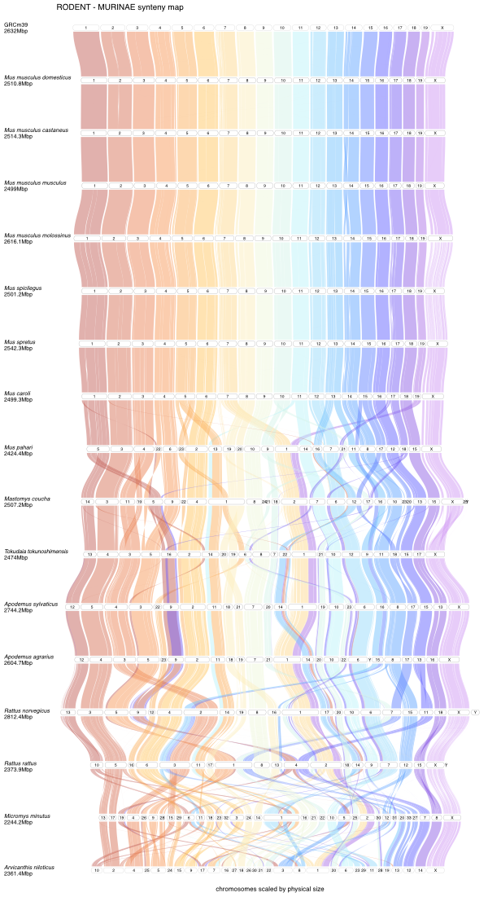

To reproduce figure 2 you would need the following external software:

- IQ-TREE (version 2.2.0) (http://www.iqtree.org/)
- R (version 4.4.0+) (https://cran.r-project.org/)
- figtree (version 1.4.4) (http://tree.bio.ed.ac.uk/software/figtree/)
- minimap2 (version 2.2.8) (https://github.com/lh3/minimap2)
- MCScanX (version 1.0.0) (https://github.com/wyp1125/MCScanX)

The following R packages are needed:

- Biostrings (https://bioconductor.org/packages/release/bioc/html/Biostrings.html)
- DECIPHER (https://bioconductor.org/packages/release/bioc/html/DECIPHER.html)
- MSA2dist (https://bioconductor.org/packages/release/bioc/html/MSA2dist.html)
- DEEPSPACE (https://github.com/jtlovell/DEEPSPACE)

The following data was used:

| species | genomeID | mt_nucID | assemblyID |
| ------- | ----- | ----- | ------ |
| Apodemus agrarius | APOAGR | NC 016428.1 | GCA_964023405.1 |
| Apodemus sylvaticus | APOSYL | NC 049122.1 | GCF_947179515.1 |
| Apodemus uralensis | - | personal communication | - |
| Arvicanthis niloticus | ARVNIL | CM022273.1 | GCA_011762505.3 |
| Grammomys surdaster | - | MN807579.1 | - | 
| Hylomyscus alleni | - | MZ131547.1 | - |
| Mastomys coucha | MASCOU | MF062946.1 | GCA_008632895.1 |
| Mastomys natalensis | - | MG017593.1 | - |
| Micromys minutus | MICMIN | OZ004814.1 | GCA_963924665.1 |
| Mus baoulei | - | MN964115.1 | - |
| Mus caroli | MUSCAR | KJ530558.1 | GCF_900094665.2 |
| Mus cervicolor | - | KJ530559.1 | - |
| Mus cookii | - | KJ530561.1 | - |
| Mus famulus | - | KX084803.1 | - |
| Mus fragilicauda | - | KJ530563.1 | - |
| Mus macedonicus | - | OR840781.1 | - |
| Mus mattheyi | - | personal communication | - |
| Mus minutoides | MUSMIN | OP764675.1 | - |
| Mus musculus C57BL 6J | GRCm39 | AY172335.1 | GCF_000001635.27 |
| Mus musculus castaneus | MUSCAS | OW971845.1 | GCA_921999005.2 |
| Mus musculus domesticus | MUSDOM | OW971635.1 | GCA_921998345.2 |
| Mus musculus molossinus | MUSMOL | OW971677.1 | GCA_921999095.2 |
| Mus musculus musculus | MUSMUS | OW971782.1 | GCA_921998335.2 |
| Mus pahari | MUSPAH | NC 036680.1 | CF_900095145.1 |
| Mus spicilegus | MUSSPI | NC 085425.1 | GCA_003336285.2 |
| Mus spretus | MUSSPR | OW971698.1 | GCA_921997135.2 |
| Mus terricolor | - | EU352649.1 | - |
| Rattus norvegicus | RATNOR | AY172581.1 | GCF_036323735.1 |
| Rattus rattus | RATRAT | EU273707.1 | GCF_011064425.1 |
| Tokudaia osimensis | - | LC642727.1 | - |
| Tokudaia tokunoshimensis | TOKTOK | LC778284.1 | GCA_036184795.1 |

All related input files (e.g. `FASTA` files reduced to only chromosomes) can be found here:

edmond-link here

Get multiple sequence alignment of mitochondria (in R):

```
library(Biostrings)
library(DECIPHER)
library(MSA2dist)
dna <- Biostrings::readDNAStringSet("rodents_mt.fasta")
msa <- DECIPHER::AlignSeqs(dna)
Biostrings::writeXStringSet(msa, file="msa.fasta")
keep.idx <- which(apply(as.matrix(msa), 2, function(x) all(x!="-")))
msa.nogaps <- MSA2dist::subString(msa, keep.idx, keep.idx)
Biostrings::writeXStringSet(msa.nogaps, file="msa.nogaps.fasta")
```

Model prediction with iq-tree:

```
iqtree2 -s msa.nogaps.fasta -m TEST_ONLY -nt 48
iqtree2 -s msa.nogaps.fasta -m GTR+F+I+G4 -nt 48 -redo -B 10000 -alrt 1000 -lbp 1000
```

To construct riparian plots of whole genomes, the `DEEPSPACE` R package was used (https://github.com/jtlovell/DEEPSPACE):

```
library(DEEPSPACE)
genomeIDs <- c("GRCm39", "MUSDOM", "MUSCAS", "MUSMUS", "MUSMOL", "MUSSPI", "MUSSPR", "MUSCAR", "MUSPAH", "MASCOU", "TOKTOK", "APOSYL", "APOAGR", "RATNOR", "RATRAT", "MICMIN", "ARVNIL")
fastaFiles <- c(
  "GRCm39_GCF_000001635.27.masked.chr_only.fasta",
  "MUSDOM_WSB_GCA_921998345.2.masked.chr_only.fasta",
  "MUSCAS_CAST_GCA_921999005.2.masked.chr_only.fasta",
  "MUSMUS_PWK_GCA_921998335.2.masked.chr_only.fasta",
  "MUSMOL_JF1_GCA_921999095.2.masked.chr_only.fasta",
  "MUSSPI_MUSP714_GCA_003336285.2.masked.1e6.ordered.fasta",
  "MUSSPR_SPRETUS_GCA_921997135.2.masked.chr_only.fasta",
  "MUSCAR_GCF_900094665.2.masked.chr_only.fasta",
  "MUSPAH_GCF_900095145.1.masked.chr_only.fasta",
  "MASCOU_GCA_008632895.1.masked.chr_only.ordered.fasta",
  "TOKTOK_GCA_036184795.1_Ttok1_genomic.chr_only.ordered.fasta",
  "APOSYL_GCF_947179515.1.masked.chr_only.ordered.fasta",
  "APOAGR_GCA_964023405.1.masked.chr_only.named.ordered.fasta",
  "RATNOR_GRCr8_GCF_036323735.1.masked.chr_only.ordered.fasta",
  "RATRAT_GCF_011064425.1_Rrattus_CSIRO_v1_genomic.chr_only.ordered.fasta"
  "MICMIN_GCA_963924665.1_mMicMin1.1_genomic.chr_only.ordered.fasta",
  "ARVNIL_GCA_011762505.3_mArvNil1.pat.X_genomic.chr_only.ordered.fasta")
names(fastaFiles) <- genomeIDs

rodents <- DEEPSPACE::clean_windows(
  faFiles = fastaFiles,
  genomeIDs = genomeIDs,
  wd = getwd(),
  preset = "dist fast",
  minChrLen = 1e5,
  nCores = 64,
  MCScanX_hCall = "/opt/MCScanX-1.0.0/MCScanX_h",
  minimap2call = "/opt/minimap2-2.28_x64-linux/minimap2")

riparian_paf(
  pafFiles=rodents$mapFilePaths$synFile,
  refGenome=rodents$refGenome,
  genomeIDs=rodents$genomeIDs)
```


