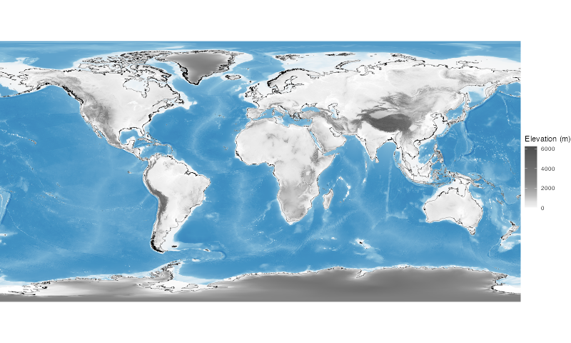

To reproduce figure 3 you would need the following external software:

- R (version 4.4.0+) (https://cran.r-project.org/)

The following R packages are needed:

- terra (https://cran.r-project.org/web/packages/terra/index.html)
- rnaturalearth (https://cran.r-project.org/web/packages/rnaturalearth/index.html)
- rnaturalearthdata (https://cran.r-project.org/web/packages/rnaturalearthdata/index.html)
- ggplot2 (https://cran.r-project.org/web/packages/ggplot2/index.html)
- sf (https://cran.r-project.org/web/packages/sf/index.html)

Location of house mouse sequening data and range of species distribution were obtained from different publications and used to overlay the world map.

```
wget https://www.ngdc.noaa.gov/mgg/global/relief/ETOPO1/data/ice_surface/cell_registered/netcdf/ETOPO1_Ice_c_gmt4.grd.gz
gunzip ETOPO1_Ice_c_gmt4.grd.gz
```

```
library(terra)
library(ggplot2)
library(rnaturalearth)
library(rnaturalearthdata)
library(sf)

# Load and aggregate raster
r <- rast("/Users/ullrich/Downloads/ETOPO1_Ice_c_gmt4.grd")
r_small <- aggregate(r, fact=10)

# Convert to dataframe
df_all <- as.data.frame(r_small, xy=TRUE)
colnames(df_all) <- c("x", "y", "elevation")

# Split land/sea
df_sea  <- subset(df_all, elevation<0)
df_land <- subset(df_all, elevation>=0)

# Get continent outlines only
coastline <- ne_download(scale=10, type="coastline", category="physical", returnclass="sf")

# Plot
p1 <- ggplot() +
  geom_raster(data=df_sea, aes(x=x, y=y, fill=elevation), interpolate=TRUE) +
  scale_fill_gradientn(
    colours = c("#2166ac", "#4393c3", "#92c5de", "#d1e5f0", "#f7f7f7"),
    values = scales::rescale(c(-10000, -5000, -1000, -500, 0)),
    guide = "none"
  ) +
  new_scale_fill() +
  geom_raster(data=df_land, aes(x=x, y=y, fill=elevation), interpolate=TRUE) +
  scale_fill_gradientn(
    colours = c("#ffffff", "#f0f0f0", "#e0e0e0", "#bababa", "#878787", "#4d4d4d"),
    values = scales::rescale(c(1, 100, 500, 1000, 2000, 5000)),
    name = "Elevation (m)"
  ) +
  geom_sf(data=coastline, color="#000000", linewidth=0.1) +  # Only land outlines
  coord_sf(expand=FALSE) +
  theme_void()

ggsave("world_map_elevation.png", plot=p1, width=800, height=480, units="px", dpi=72)
```


