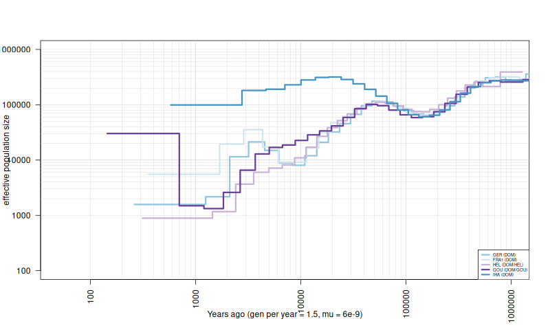

__Note:__ As a prerequisite to run `msmc2` one needs to have `GVCF` files for individuals and combine them per population.

All related input files can be found here:

edmond-link here

The scripts used to map individual `FASTQ` files against the reference `GRCm39`, to apply base quality score recalibration and call SNPs can be found in the [`mm39_mapping`](mm39_mapping/README.md) directory.

To reproduce figure 4 you would need the following external software:

- msmc2 (version 2.1.4) (https://github.com/stschiff/msmc2)

To prepare input files for msmc2 the script `vcfAllSiteParser2.py` was used, it takes combined autosomes `GVCF` files as input and produces for each chromosome one `VCF` and one `mask` file to be used with the `generate_multihetsep.py` script from `msmc2`:

```
python vcfAllSiteParser2.py GER.1.autosomes.g.vcf.gz GER.1
python vcfAllSiteParser2.py GER.2.autosomes.g.vcf.gz GER.2
python vcfAllSiteParser2.py GER.3.autosomes.g.vcf.gz GER.3
python vcfAllSiteParser2.py GER.4.autosomes.g.vcf.gz GER.4
python vcfAllSiteParser2.py GER.5.autosomes.g.vcf.gz GER.5
python vcfAllSiteParser2.py GER.6.autosomes.g.vcf.gz GER.6
python vcfAllSiteParser2.py GER.7.autosomes.g.vcf.gz GER.7
python vcfAllSiteParser2.py GER.8.autosomes.g.vcf.gz GER.8
```

As a negative mask for each chromosome, the `RepeatMasker` resuluts from the reference `GRCm39` as indicated in the directory `fig1` was used to mask repeats.

Final `msmc2` input was created with the `generate_multihetsep.py` script from `msmc2`:

```
/opt/msmc2/msmc-tools/generate_multihetsep.py --mask GER.1_chr1_mask.bed.gz --negative_mask chr1.bed.gz GER.1_chr1.vcf.gz > input_msmc2.GER.1.chr1.txt
/opt/msmc2/msmc-tools/generate_multihetsep.py --mask GER.1_chr2_mask.bed.gz --negative_mask chr2.bed.gz GER.1_chr2.vcf.gz > input_msmc2.GER.1.chr2.txt
/opt/msmc2/msmc-tools/generate_multihetsep.py --mask GER.1_chr3_mask.bed.gz --negative_mask chr3.bed.gz GER.1_chr3.vcf.gz > input_msmc2.GER.1.chr3.txt
/opt/msmc2/msmc-tools/generate_multihetsep.py --mask GER.1_chr4_mask.bed.gz --negative_mask chr4.bed.gz GER.1_chr4.vcf.gz > input_msmc2.GER.1.chr4.txt
/opt/msmc2/msmc-tools/generate_multihetsep.py --mask GER.1_chr5_mask.bed.gz --negative_mask chr5.bed.gz GER.1_chr5.vcf.gz > input_msmc2.GER.1.chr5.txt
/opt/msmc2/msmc-tools/generate_multihetsep.py --mask GER.1_chr6_mask.bed.gz --negative_mask chr6.bed.gz GER.1_chr6.vcf.gz > input_msmc2.GER.1.chr6.txt
/opt/msmc2/msmc-tools/generate_multihetsep.py --mask GER.1_chr7_mask.bed.gz --negative_mask chr7.bed.gz GER.1_chr7.vcf.gz > input_msmc2.GER.1.chr7.txt
/opt/msmc2/msmc-tools/generate_multihetsep.py --mask GER.1_chr8_mask.bed.gz --negative_mask chr8.bed.gz GER.1_chr8.vcf.gz > input_msmc2.GER.1.chr8.txt
/opt/msmc2/msmc-tools/generate_multihetsep.py --mask GER.1_chr9_mask.bed.gz --negative_mask chr9.bed.gz GER.1_chr9.vcf.gz > input_msmc2.GER.1.chr9.txt
/opt/msmc2/msmc-tools/generate_multihetsep.py --mask GER.1_chr10_mask.bed.gz --negative_mask chr10.bed.gz GER.1_chr10.vcf.gz > input_msmc2.GER.1.chr10.txt
/opt/msmc2/msmc-tools/generate_multihetsep.py --mask GER.1_chr11_mask.bed.gz --negative_mask chr11.bed.gz GER.1_chr11.vcf.gz > input_msmc2.GER.1.chr11.txt
/opt/msmc2/msmc-tools/generate_multihetsep.py --mask GER.1_chr12_mask.bed.gz --negative_mask chr12.bed.gz GER.1_chr12.vcf.gz > input_msmc2.GER.1.chr12.txt
/opt/msmc2/msmc-tools/generate_multihetsep.py --mask GER.1_chr13_mask.bed.gz --negative_mask chr13.bed.gz GER.1_chr13.vcf.gz > input_msmc2.GER.1.chr13.txt
/opt/msmc2/msmc-tools/generate_multihetsep.py --mask GER.1_chr14_mask.bed.gz --negative_mask chr14.bed.gz GER.1_chr14.vcf.gz > input_msmc2.GER.1.chr14.txt
/opt/msmc2/msmc-tools/generate_multihetsep.py --mask GER.1_chr15_mask.bed.gz --negative_mask chr15.bed.gz GER.1_chr15.vcf.gz > input_msmc2.GER.1.chr15.txt
/opt/msmc2/msmc-tools/generate_multihetsep.py --mask GER.1_chr16_mask.bed.gz --negative_mask chr16.bed.gz GER.1_chr16.vcf.gz > input_msmc2.GER.1.chr16.txt
/opt/msmc2/msmc-tools/generate_multihetsep.py --mask GER.1_chr17_mask.bed.gz --negative_mask chr17.bed.gz GER.1_chr17.vcf.gz > input_msmc2.GER.1.chr17.txt
/opt/msmc2/msmc-tools/generate_multihetsep.py --mask GER.1_chr18_mask.bed.gz --negative_mask chr18.bed.gz GER.1_chr18.vcf.gz > input_msmc2.GER.1.chr18.txt
/opt/msmc2/msmc-tools/generate_multihetsep.py --mask GER.1_chr19_mask.bed.gz --negative_mask chr19.bed.gz GER.1_chr19.vcf.gz > input_msmc2.GER.1.chr19.txt
```

`msmc2` was run with the following settings for each individual:

```
/opt/msmc2/msmc2_Linux -t 24 -p 1*4+25*2+1*4+1*6 -I 0-1 -o GER.1.msmc2 input_msmc2.GER.1.chr1.txt input_msmc2.GER.1.chr2.txt input_msmc2.GER.1.chr3.txt input_msmc2.GER.1.chr4.txt input_msmc2.GER.1.chr5.txt input_msmc2.GER.1.chr6.txt input_msmc2.GER.1.chr7.txt input_msmc2.GER.1.chr8.txt input_msmc2.GER.1.chr9.txt input_msmc2.GER.1.chr10.txt input_msmc2.GER.1.chr11.txt input_msmc2.GER.1.chr12.txt input_msmc2.GER.1.chr13.txt input_msmc2.GER.1.chr14.txt input_msmc2.GER.1.chr15.txt input_msmc2.GER.1.chr16.txt input_msmc2.GER.1.chr17.txt input_msmc2.GER.1.chr18.txt input_msmc2.GER.1.chr19.txt
```

Foe each population the final `msmc2` input was created using the individual files, here we give one example for the first chromosome, the same negative mask files were used as for individuals:

```
/opt/msmc2/msmc-tools/generate_multihetsep.py \
--mask ../GER1/GER.1_chr1_mask.bed.gz \
--mask ../GER2/GER.2_chr1_mask.bed.gz \
--mask ../GER3/GER.3_chr1_mask.bed.gz \
--mask ../GER4/GER.4_chr1_mask.bed.gz \
--mask ../GER5/GER.5_chr1_mask.bed.gz \
--mask ../GER6/GER.6_chr1_mask.bed.gz \
--mask ../GER7/GER.7_chr1_mask.bed.gz \
--mask ../GER8/GER.8_chr1_mask.bed.gz \
--negative_mask ../chr1.bed.gz \
--negative_mask ../chr1.bed.gz \
--negative_mask ../chr1.bed.gz \
--negative_mask ../chr1.bed.gz \
--negative_mask ../chr1.bed.gz \
--negative_mask ../chr1.bed.gz \
--negative_mask ../chr1.bed.gz \
--negative_mask ../chr1.bed.gz \
../GER1/GER.1_chr1.vcf.gz \
../GER2/GER.2_chr1.vcf.gz \
../GER3/GER.3_chr1.vcf.gz \
../GER4/GER.4_chr1.vcf.gz \
../GER5/GER.5_chr1.vcf.gz \
../GER6/GER.6_chr1.vcf.gz \
../GER7/GER.7_chr1.vcf.gz \
../GER8/GER.8_chr1.vcf.gz \
> input_msmc2.popGER.chr1.txt
```

`msmc2` was run with the following settings for each population (setting the corresponding number of individuals):

```
/opt/msmc2/msmc2_Linux -t 24 -p 1*4+25*2+1*4+1*6 -I 0-1,2-3,4-5,6-7,8-9,10-11,12-13,14-15 -o popGER.msmc2 input_msmc2.popGER.chr1.txt input_msmc2.popGER.chr2.txt input_msmc2.popGER.chr3.txt input_msmc2.popGER.chr4.txt input_msmc2.popGER.chr5.txt input_msmc2.popGER.chr6.txt input_msmc2.popGER.chr7.txt input_msmc2.popGER.chr8.txt input_msmc2.popGER.chr9.txt input_msmc2.popGER.chr10.txt input_msmc2.popGER.chr11.txt input_msmc2.popGER.chr12.txt input_msmc2.popGER.chr13.txt input_msmc2.popGER.chr14.txt input_msmc2.popGER.chr15.txt input_msmc2.popGER.chr16.txt input_msmc2.popGER.chr17.txt input_msmc2.popGER.chr18.txt input_msmc2.popGER.chr19.txt
```

`msmc2` results can be plotted in R as follows:

```
png("house_mouse_DOM_population_history.png", width=800, height=480)
options(scipen=22)
mu <- 6e-9
gen <- 1.5
popGER<-read.table("popGER/popGER.msmc2.final.txt", header=TRUE)
popFRA1<-read.table("popFRA1/popFRA1.msmc2.final.txt", header=TRUE)
popHEL<-read.table("popHEL/popHEL.msmc2.final.txt", header=TRUE)
popGOU<-read.table("popGOU/popGOU.msmc2.final.txt", header=TRUE)
popIRA<-read.table("popIRA/popIRA.msmc2.final.txt", header=TRUE)
Dat <- popGER
plot(x=Dat$left_time_boundary/mu*gen,
  y=(1/Dat$lambda)/(2*mu),
  log="xy",
  ylim=c(100,1000000),
  xlim=c(50,1000000),
  type="n",
  xlab="Years ago (gen per year = 1.5, mu = 6e-9)",
  ylab="effective population size",
  las=2)
abline(h=seq(from=1000,to=10000,by=1000), col="lightgrey", lwd=0.5)
abline(h=seq(from=10000,to=100000,by=10000), col="lightgrey", lwd=0.5)
abline(h=seq(from=100000,to=1000000,by=100000), col="lightgrey", lwd=0.5)
abline(v=seq(from=100,to=1000,by=100), col="lightgrey", lwd=0.5)
abline(v=seq(from=1000,to=10000,by=1000), col="lightgrey", lwd=0.5)
abline(v=seq(from=10000,to=100000,by=10000), col="lightgrey", lwd=0.5)
abline(v=seq(from=100000,to=1000000,by=100000), col="lightgrey", lwd=0.5)
popCol <- c("#92c5de", "#d1e5f0", "#cab2d6", "#6a3d9a", "#4393c3")
lines(popGER$left_time_boundary/mu*gen, (1/popGER$lambda)/(2*mu), type="s", col=popCol[1], lty=1, lwd=3)
lines(popFRA1$left_time_boundary/mu*gen, (1/popFRA1$lambda)/(2*mu), type="s", col=popCol[2], lty=1, lwd=3)
lines(popHEL$left_time_boundary/mu*gen, (1/popHEL$lambda)/(2*mu), type="s", col=popCol[3], lty=1, lwd=3)
lines(popGOU$left_time_boundary/mu*gen, (1/popGOU$lambda)/(2*mu), type="s", col=popCol[4], lty=1, lwd=3)
lines(popIRA$left_time_boundary/mu*gen, (1/popIRA$lambda)/(2*mu), type="s", col=popCol[5], lty=1, lwd=3)
legend("bottomright", legend=c("GER (DOM)", "FRA1 (DOM)", "HEL (DOM/HEL)", "GOU (DOM/GOU)", "IRA (DOM)"),
  col=c(popCol[1], popCol[2], popCol[3], popCol[4], popCol[5]),
  lwd=c(3,3,3,3,3), cex=0.5)
dev.off()
```


